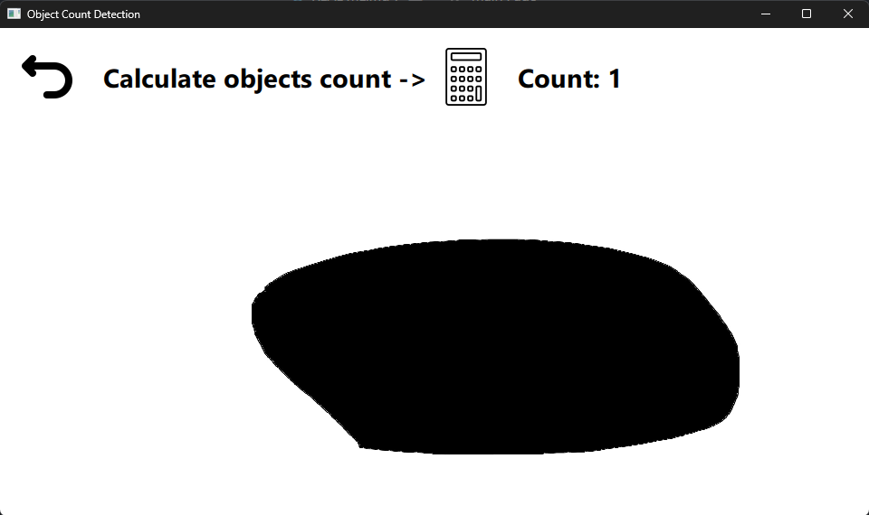
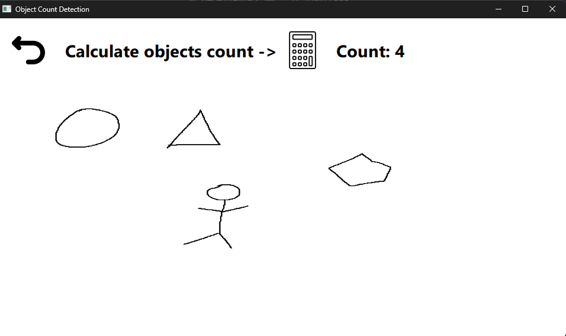

## ⛓️ Object Count Detection (C++)

## 📝 Description
This is a fun project written in C++ that can determine the number of black shapes on a white background.

## 🛠 Technical Dependencies
- `C++ 20`
- `CMake 3.14`
- `Qt 6.8.0`
- `OpenCV 4.10.0`
- `QML 6.8.0`

## 🔗 Support Status On Systems
- [ ] Linux (not verified)
- [X] Windows (verified)

## 🔗 Main Page

## 🔗 Test with 1 object

## 🔗 Test with 4 objects
